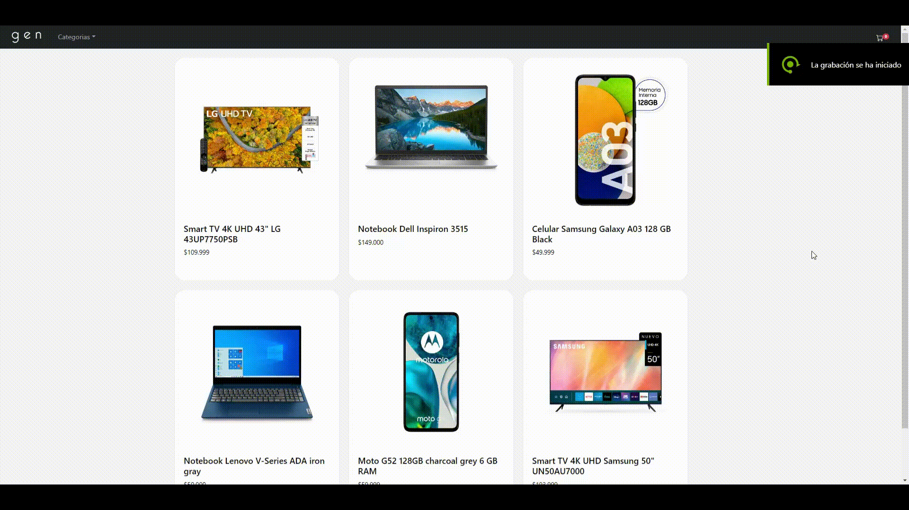

<h2 align="center">gen - ReactJS e-commerce - Curso de CoderHouse</h2>
 
<h3 align="center">Muestra de navegación en la aplicación</h3>
    

  

# Dependencias

- "@fortawesome/fontawesome-svg-core": "^6.2.0",
- "@fortawesome/free-solid-svg-icons": "^6.2.0",
- "@fortawesome/react-fontawesome": "^0.2.0",
- "@testing-library/jest-dom": "^5.16.5",
- "@testing-library/react": "^13.4.0",
- "@testing-library/user-event": "^13.5.0",
- "bootstrap": "^5.2.1",
- "firebase": "^9.12.1",
- "jquery": "^3.6.1",
- "react": "^18.2.0",
- "react-bootstrap-icons": "^1.8.4",
- "react-dom": "^18.2.0",
- "react-router-dom": "^6.4.1",
- "react-scripts": "5.0.1",
- "sass": "^1.55.0",
- "sweetalert2": "^11.6.1",
- "web-vitals": "^2.1.4",
- "webpack": "^5.74.0"

##

Link del proyecto: [https://github.com/EmilioNGuillen/React-Js-Final-CoderHouse](https://github.com/EmilioNGuillen/Proyecto-Final-React-Js-CoderHouse)

Web Deployment: [https://gen-ecommerce.netlify.app/](https://gen-ecommerce.netlify.app/)